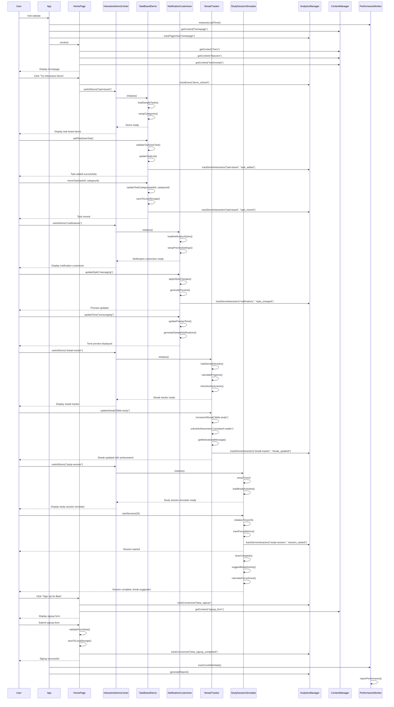

# AI Assistant App Showcase - System Design

## Implementation Approach

We will build a modern, interactive showcase website using React 18 with TypeScript, Shadcn-ui components, and Tailwind CSS. The architecture focuses on creating engaging interactive demonstrations while maintaining excellent performance and mobile responsiveness. Key challenges include:

1. **Interactive Demo Complexity**: Building realistic app simulations without backend dependencies
2. **Performance Optimization**: Ensuring fast load times with rich interactive content
3. **Mobile-First Design**: Delivering seamless experience across all device types
4. **Content Management**: Flexible system for updating showcase content and demos
5. **Analytics Integration**: Comprehensive tracking without impacting performance

**Selected Framework**: Next.js 14 with App Router for optimal performance, SEO, and developer experience
**UI Components**: Shadcn-ui for consistent design system with Tailwind CSS for styling
**State Management**: Zustand for lightweight, scalable state management
**Animation**: Framer Motion for smooth, performant animations
**Data Storage**: Local storage for demo interactions, with optional Supabase integration for analytics

## Data Structures and Interfaces

```mermaid
classDiagram
    class App {
        +main() void
        +initializeRouting() void
        +setupAnalytics() void
    }
    
    class HomePage {
        +heroSection: HeroSection
        +featuresGrid: FeaturesGrid
        +testimonials: TestimonialSection
        +ctaSection: CTASection
        +render() JSX.Element
    }
    
    class InteractiveDemoCenter {
        +taskBoard: TaskBoardDemo
        +notificationCustomizer: NotificationCustomizer
        +streakTracker: StreakTracker
        +studySessionSim: StudySessionSimulator
        +switchDemo(demoType: string) void
        +trackDemoUsage(demoId: string) void
    }
    
    class TaskBoardDemo {
        -tasks: Task[]
        -categories: Category[]
        +addTask(task: Task) void
        +moveTask(taskId: string, categoryId: string) void
        +updateTask(taskId: string, updates: Partial<Task>) void
        +deleteTask(taskId: string) void
        +exportDemoData() DemoData
    }
    
    class Task {
        +id: string
        +title: string
        +description: string
        +dueDate: Date
        +priority: Priority
        +category: string
        +completed: boolean
        +createdAt: Date
        +tags: string[]
    }
    
    class Category {
        +id: string
        +name: string
        +color: string
        +icon: string
        +taskCount: number
    }
    
    class NotificationCustomizer {
        -notificationStyles: NotificationStyle[]
        -previewSettings: NotificationSettings
        +updateStyle(styleType: string) void
        +updateTone(tone: string) void
        +updateFrequency(frequency: string) void
        +generatePreview() NotificationPreview
        +saveCustomization() void
    }
    
    class NotificationStyle {
        +id: string
        +name: string
        +template: string
        +appearance: StyleConfig
        +examples: string[]
    }
    
    class NotificationSettings {
        +style: string
        +tone: string
        +frequency: string
        +platforms: string[]
        +timePreferences: TimePreference[]
    }
    
    class StreakTracker {
        -streaks: Streak[]
        -achievements: Achievement[]
        +updateStreak(habitId: string) void
        +calculateProgress() ProgressData
        +unlockAchievement(achievementId: string) void
        +getMotivationalMessage() string
    }
    
    class Streak {
        +id: string
        +habitName: string
        +currentStreak: number
        +longestStreak: number
        +lastUpdated: Date
        +category: string
    }
    
    class Achievement {
        +id: string
        +title: string
        +description: string
        +icon: string
        +unlocked: boolean
        +unlockedAt: Date
        +requirements: AchievementRequirement[]
    }
    
    class StudySessionSimulator {
        -sessionData: StudySession
        -timerState: TimerState
        +startSession(duration: number) void
        +pauseSession() void
        +completeSession() void
        +suggestBreakActivity() BreakActivity
        +trackFocusMetrics() FocusMetrics
    }
    
    class StudySession {
        +id: string
        +subject: string
        +plannedDuration: number
        +actualDuration: number
        +breaks: Break[]
        +focusScore: number
        +completedAt: Date
    }
    
    class ResponsiveLayout {
        +breakpoints: Breakpoint[]
        +currentBreakpoint: string
        +isMobile() boolean
        +isTablet() boolean
        +isDesktop() boolean
        +adaptLayout(component: Component) Component
    }
    
    class ContentManager {
        -content: ContentItem[]
        +getContent(pageId: string) ContentItem[]
        +updateContent(itemId: string, content: any) void
        +validateContent(content: ContentItem) boolean
        +cacheContent() void
    }
    
    class AnalyticsManager {
        +trackPageView(page: string) void
        +trackEvent(event: string, properties: object) void
        +trackDemoInteraction(demoId: string, action: string) void
        +trackConversion(type: string) void
        +generateReport() AnalyticsReport
    }
    
    class PerformanceMonitor {
        +measureLoadTime() number
        +trackCoreWebVitals() WebVitals
        +optimizeImages() void
        +lazyLoadComponents() void
        +reportPerformance() PerformanceReport
    }
    
    App --> HomePage
    App --> InteractiveDemoCenter
    App --> ResponsiveLayout
    App --> ContentManager
    App --> AnalyticsManager
    App --> PerformanceMonitor
    
    HomePage --> HeroSection
    HomePage --> FeaturesGrid
    HomePage --> TestimonialSection
    HomePage --> CTASection
    
    InteractiveDemoCenter --> TaskBoardDemo
    InteractiveDemoCenter --> NotificationCustomizer
    InteractiveDemoCenter --> StreakTracker
    InteractiveDemoCenter --> StudySessionSimulator
    
    TaskBoardDemo --> Task
    TaskBoardDemo --> Category
    
    NotificationCustomizer --> NotificationStyle
    NotificationCustomizer --> NotificationSettings
    
    StreakTracker --> Streak
    StreakTracker --> Achievement
    
    StudySessionSimulator --> StudySession
```

## Program Call Flow

## Anything UNCLEAR

The following aspects need clarification for optimal implementation:

1. **Demo Data Persistence**: Should user interactions with demos be saved across sessions, or reset each time? This affects whether we use localStorage, sessionStorage, or no persistence.

2. **Analytics Privacy**: What level of user tracking is acceptable? Need to balance comprehensive analytics with privacy compliance (GDPR/CCPA).

3. **Demo Realism Level**: How closely should the demos simulate actual app functionality? Should they include error states, loading states, and edge cases?

4. **Content Update Frequency**: Will the showcase content need regular updates? This affects whether we need a headless CMS integration or static content management.

5. **Performance vs. Features Trade-off**: What's the priority when interactive features might impact load times? Should we implement progressive loading or prioritize immediate interactivity?

6. **Offline Functionality**: Should the demos work offline for PWA capabilities, or is online-only acceptable?

7. **Integration Depth**: For the cloud storage integration demos, should we show actual API connections or simulated interfaces?

8. **Accessibility Requirements**: What level of WCAG compliance is required? This affects component complexity and testing requirements.

**Recommended Clarifications:**
- Confirm data persistence strategy for demo interactions
- Define analytics tracking boundaries and privacy requirements  
- Specify demo fidelity level and error handling approach
- Determine content management and update workflow needs
- Establish performance benchmarks and acceptable trade-offs