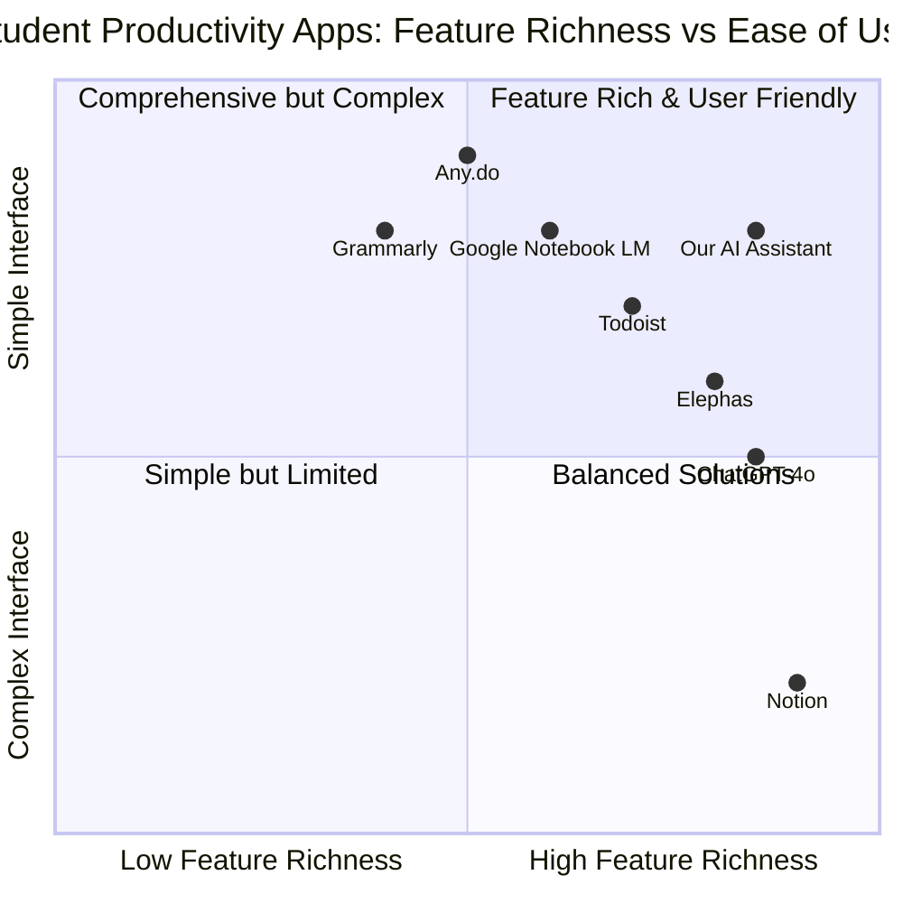
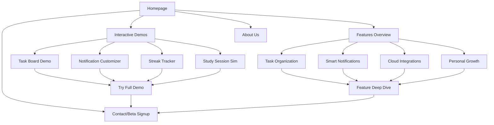

# Product Requirements Document (PRD)
# AI Assistant App for College Students - Website Showcase

## 1. Language & Project Information

**Language:** English  
**Programming Language:** Shadcn-ui, TypeScript, and Tailwind CSS  
**Project Name:** ai_assistant_app_showcase  
**Original Requirements:** Create a detailed proposal for a website showcasing a hypothetical AI assistant app for college students with comprehensive features including task organization, customizable notifications, cloud integrations, positive habit encouragement, and interactive demonstrations.

## 2. Product Definition

### 2.1 Product Goals

1. **Showcase Innovation**: Demonstrate a cutting-edge AI assistant app specifically designed for college students' academic and personal growth needs
2. **Drive User Engagement**: Create an interactive website experience that allows prospective users to explore app features through demos, simulations, and customization tools
3. **Market Differentiation**: Position the AI assistant as a holistic solution that balances productivity with personal development, setting it apart from purely task-focused competitors

### 2.2 User Stories

**As a college student**, I want to see how the AI assistant organizes my academic tasks so that I can understand if it will help me manage my coursework effectively.

**As a prospective user**, I want to customize notification settings in a demo environment so that I can experience how the app adapts to my communication preferences.

**As a student interested in personal growth**, I want to explore how the app encourages positive activities like Bible study and hobbies so that I can see if it aligns with my values.

**As a mobile user**, I want to experience the app's interface on my phone so that I can evaluate its usability across devices.

**As a student using Google Docs**, I want to see how the app integrates with my existing cloud storage so that I can understand the workflow benefits.

### 2.3 Competitive Analysis

Based on market research, here are key competitors in the student productivity space:

**Notion**
- *Pros*: Comprehensive all-in-one workspace, highly customizable, strong collaboration features
- *Cons*: Steep learning curve, can be overwhelming for simple task management, $4/month for pro features

**Todoist**
- *Pros*: Natural language processing, balanced functionality, cross-platform sync, $4-5/month
- *Cons*: Limited customization compared to Notion, lacks comprehensive study tools

**Elephas**
- *Pros*: Best overall AI assistant for students, offline mode, personalized knowledge management, $8.99/month
- *Cons*: Higher price point, limited integration with existing student workflows

**Google Notebook LM**
- *Pros*: Free AI-powered note-taking, document analysis, Google ecosystem integration
- *Cons*: Limited task management features, lacks gamification elements

**Any.do**
- *Pros*: Clean visual interface, WhatsApp integration, AI assistant features, $4.99/month
- *Cons*: Less comprehensive than competitors, limited academic-specific features

**Grammarly**
- *Pros*: Excellent writing assistance, widely adopted, strong AI capabilities
- *Cons*: Focused only on writing, lacks comprehensive productivity features

**ChatGPT-4o**
- *Pros*: Advanced AI capabilities, versatile tutoring assistance, strong research support
- *Cons*: Not specifically designed for student workflows, lacks task organization

### 2.4 Competitive Quadrant Chart

## 3. Technical Specifications

### 3.1 Requirements Analysis

The website must serve as a comprehensive showcase platform that demonstrates the AI assistant app's capabilities while providing interactive experiences for prospective users. Key technical needs include:

- **Responsive Design**: Seamless experience across desktop, tablet, and mobile devices
- **Interactive Demonstrations**: Real-time simulations of app features without requiring actual app installation
- **Performance Optimization**: Fast loading times and smooth animations to maintain user engagement
- **Content Management**: Dynamic content system for easy updates to app features and demonstrations
- **Analytics Integration**: User behavior tracking to optimize the showcase experience
- **SEO Optimization**: Strong search engine visibility for student-focused keywords

### 3.2 Requirements Pool

#### P0 Requirements (Must-Have)
- Responsive web design compatible with all major browsers
- Interactive task organization board demonstration
- Customizable notification settings simulator
- Mobile-first design approach
- Core feature showcase sections
- Contact/interest capture forms
- Basic analytics implementation

#### P1 Requirements (Should-Have)
- Gamified streak tracker simulation
- Hypothetical study session demonstrations
- Video walkthroughs and app demos
- Advanced animation and micro-interactions
- Social media integration
- Email newsletter signup
- Performance optimization (sub-3-second load times)

#### P2 Requirements (Nice-to-Have)
- AI chatbot for visitor questions
- User testimonial collection system
- A/B testing framework for different showcase approaches
- Advanced analytics and heat mapping
- Multi-language support
- Accessibility compliance (WCAG 2.1 AA)
- Progressive Web App (PWA) capabilities

### 3.3 UI Design Draft

#### Homepage Layout
- **Hero Section**: Compelling headline with animated app preview
- **Feature Highlights**: Interactive cards showcasing core functionalities
- **Demo Section**: Embedded interactive demonstrations
- **Social Proof**: Student testimonials and usage statistics
- **CTA Section**: Clear call-to-action for app interest/beta signup

#### Interactive Elements Layout
- **Task Board Demo**: Drag-and-drop interface showing task organization
- **Notification Customizer**: Real-time preview of different notification styles
- **Streak Tracker**: Animated progress visualization
- **Integration Showcase**: Visual representation of cloud storage connections

#### Mobile Considerations
- Thumb-friendly navigation
- Swipeable demo carousels
- Collapsible sections for content density
- Touch-optimized interactive elements

### 3.4 Open Questions

1. **Data Privacy**: How will user interactions with demos be handled regarding data collection and privacy?
2. **Demo Limitations**: What level of functionality should be simulated vs. actual working features?
3. **Update Frequency**: How often will the showcase content need updates to reflect app development progress?
4. **Integration Testing**: How will we validate that integration demonstrations accurately represent actual app capabilities?
5. **Performance Benchmarks**: What are the specific performance targets for different device types and connection speeds?

## 4. Target Audience Analysis

### 4.1 Primary User Personas

#### Persona 1: "Academic Achiever" - Sarah Chen
- **Demographics**: 20 years old, Junior at State University, Computer Science major
- **Goals**: Maintain high GPA, manage multiple coding projects, prepare for internships
- **Pain Points**: Juggling coursework with personal projects, staying organized across multiple platforms
- **Tech Comfort**: High - uses multiple productivity apps, early adopter
- **Motivations**: Efficiency, academic excellence, career preparation

#### Persona 2: "Balanced Student" - Marcus Rodriguez
- **Demographics**: 19 years old, Sophomore at Community College, Business major
- **Goals**: Balance academics with part-time work, maintain social connections, personal growth
- **Pain Points**: Time management between work and study, staying motivated, maintaining healthy habits
- **Tech Comfort**: Medium - uses basic apps, prefers simple interfaces
- **Motivations**: Work-life balance, personal development, spiritual growth

#### Persona 3: "Overwhelmed Freshman" - Emma Thompson
- **Demographics**: 18 years old, Freshman at Liberal Arts College, Undecided major
- **Goals**: Adapt to college life, develop study habits, explore interests
- **Pain Points**: Feeling overwhelmed by new responsibilities, difficulty with time management
- **Tech Comfort**: Medium - familiar with social media, learning productivity tools
- **Motivations**: Academic success, personal organization, social integration

### 4.2 Secondary Audiences

- **Parents**: Interested in tools that support their children's academic success
- **Academic Advisors**: Looking for resources to recommend to struggling students
- **Educational Technology Enthusiasts**: Early adopters interested in AI-powered learning tools

## 5. Website Requirements and Deliverables

### 5.1 Comprehensive Feature List

#### Core Website Features
1. **Responsive Landing Page**
   - Hero section with animated app preview
   - Feature overview with interactive elements
   - Student testimonials and social proof
   - Clear value proposition messaging

2. **Interactive Demo Center**
   - Task organization board simulation
   - Notification customization tool
   - Workflow categorization system demo
   - Cloud integration visualization

3. **Feature Deep Dives**
   - Detailed pages for each major app feature
   - Use case scenarios and examples
   - Benefits and ROI for students
   - Comparison with existing solutions

4. **Resource Hub**
   - Blog section with productivity tips
   - Student success stories
   - Academic calendar integration guides
   - Study methodology resources

#### Interactive Elements Specifications

1. **Virtual Task Organization Board**
   - Drag-and-drop task creation and management
   - Category-based organization (Academic, Personal, Spiritual)
   - Priority level visualization
   - Due date and reminder settings
   - Progress tracking simulation

2. **Interactive Notification Customization Tools**
   - Real-time preview of notification styles
   - Platform-specific customization (SMS, Snapchat, Standard)
   - Tone adjustment (Professional, Casual, Encouraging)
   - Frequency and timing controls
   - Sample notification generation

3. **Gamified Streak Tracker**
   - Visual progress indicators
   - Achievement badges and milestones
   - Habit formation visualization
   - Social sharing capabilities
   - Motivational messaging system

4. **Hypothetical Study Session Simulations**
   - Pomodoro timer integration
   - Focus mode demonstrations
   - Break activity suggestions
   - Progress tracking visualization
   - Distraction management tools

### 5.2 Wireframes and Mockups Specifications

#### Desktop Wireframes (1920x1080)
- **Homepage**: Hero, features grid, testimonials, CTA
- **Demo Page**: Interactive elements with sidebar navigation
- **Feature Pages**: Detailed descriptions with visual examples
- **About Page**: Team information and company mission

#### Mobile Wireframes (375x812)
- **Mobile Homepage**: Stacked sections with thumb navigation
- **Mobile Demo**: Swipeable cards with touch interactions
- **Mobile Features**: Accordion-style expandable sections

#### Design System Requirements
- **Color Palette**: Primary (Blue #2563EB), Secondary (Green #059669), Accent (Purple #7C3AED)
- **Typography**: Inter for headings, Source Sans Pro for body text
- **Spacing**: 8px grid system for consistent layouts
- **Components**: Reusable button, card, and form components

### 5.3 Sample Notification Designs Requirements

#### Notification Style Variations
1. **Standard Notifications**
   - Clean, professional appearance
   - Clear action buttons
   - Minimal design with essential information
   - System-native appearance

2. **Messaging Style**
   - Conversational tone and language
   - Emoji integration for emotional context
   - Chat bubble appearance
   - Casual, friendly messaging

3. **Snapchat Style**
   - Visual-first approach with icons
   - Playful animations and transitions
   - Streak-based motivation
   - Social sharing integration

#### Content Templates
- Assignment reminders with encouraging language
- Study break suggestions with activity options
- Achievement celebrations with progress visualization
- Habit formation prompts with spiritual/personal growth focus

### 5.4 Dashboard Mockups Specifications

#### Main Dashboard Layout
- **Quick Stats**: Tasks completed, streak counters, upcoming deadlines
- **Task Overview**: Today's priorities with progress indicators
- **Calendar Integration**: Upcoming events and assignments
- **Habit Tracker**: Personal growth activities and spiritual practices
- **Achievement Center**: Recent accomplishments and badges

#### Customization Options
- **Widget Arrangement**: Drag-and-drop dashboard customization
- **Theme Selection**: Light, dark, and high-contrast modes
- **Information Density**: Compact, standard, and detailed views
- **Integration Toggles**: Show/hide different connected services

### 5.5 Website Navigation Flow Diagrams

### 5.6 Content Strategy Outline

#### Content Pillars
1. **Academic Excellence**: Content focused on improving study habits and academic performance
2. **Personal Growth**: Resources for spiritual development and positive habit formation
3. **Technology Integration**: Guides for connecting existing tools and workflows
4. **Student Success**: Real stories and case studies from student users

#### Content Types
- **Educational Blog Posts**: Study tips, productivity strategies, technology guides
- **Video Content**: App demonstrations, student testimonials, tutorial walkthroughs
- **Interactive Tools**: Calculators, assessments, planning templates
- **Resource Downloads**: Study guides, templates, productivity worksheets

#### SEO Strategy
- **Primary Keywords**: "AI assistant for students", "college productivity app", "student task management"
- **Long-tail Keywords**: "AI study planner for college students", "Christian productivity app for students"
- **Content Clusters**: Productivity, study tips, college success, AI tools, spiritual growth

## 6. Design Principles

### 6.1 Clean, Modern UI with Responsive Design

#### Visual Design Standards
- **Minimalist Approach**: Clean layouts with ample white space
- **Consistent Typography**: Clear hierarchy with readable font sizes
- **Purposeful Color Usage**: Strategic use of color to guide attention and convey meaning
- **Grid-Based Layouts**: Structured content organization for visual harmony

#### Responsive Design Requirements
- **Mobile-First Approach**: Design starting from mobile constraints
- **Breakpoint Strategy**: 
  - Mobile: 320px - 768px
  - Tablet: 768px - 1024px
  - Desktop: 1024px+
- **Flexible Components**: Scalable elements that adapt to different screen sizes
- **Touch-Friendly Interactions**: Minimum 44px touch targets for mobile

### 6.2 Conversational Notification Tone

#### Voice and Tone Guidelines
- **Encouraging**: Positive, supportive language that motivates action
- **Personal**: Friendly, approachable tone that feels like a helpful friend
- **Respectful**: Acknowledges user autonomy and personal values
- **Adaptive**: Tone adjusts based on user preferences and context

#### Message Examples
- **Standard**: "Your History essay is due tomorrow. You've got this!"
- **Casual**: "Hey! 📚 Don't forget about that History essay due tomorrow!"
- **Encouraging**: "You're doing great! Just a friendly reminder about your History essay due tomorrow. Take it one step at a time!"

### 6.3 Balance Between Productivity and Personal Growth

#### Feature Integration Philosophy
- **Holistic Approach**: Productivity features seamlessly integrated with personal development
- **Value Alignment**: Respect for diverse personal values including spiritual growth
- **Sustainable Habits**: Focus on long-term habit formation rather than short-term productivity hacks
- **Well-being Priority**: Features that promote mental health and work-life balance

#### Implementation Examples
- Study break suggestions include both productivity and personal growth activities
- Achievement system rewards both academic and personal development milestones
- Notification system includes encouragement for spiritual practices and hobbies
- Task categorization includes personal growth and spiritual development categories

## 7. Technical Requirements

### 7.1 Web-Based Interface Requirements

#### Frontend Technology Stack
- **Framework**: React 18 with TypeScript for type safety and maintainability
- **UI Library**: Shadcn-ui components for consistent design system
- **Styling**: Tailwind CSS for utility-first styling approach
- **State Management**: Zustand for lightweight state management
- **Animation**: Framer Motion for smooth animations and transitions

#### Performance Requirements
- **Page Load Speed**: Under 3 seconds on 3G connections
- **Core Web Vitals**: 
  - LCP (Largest Contentful Paint): < 2.5s
  - FID (First Input Delay): < 100ms
  - CLS (Cumulative Layout Shift): < 0.1
- **Bundle Size**: JavaScript bundle under 500KB gzipped
- **Image Optimization**: WebP format with fallbacks, lazy loading

### 7.2 Mobile Responsiveness Requirements

#### Device Support
- **iOS**: Safari 14+, Chrome 90+
- **Android**: Chrome 90+, Samsung Internet 14+
- **Screen Sizes**: 320px to 2560px width support
- **Orientation**: Both portrait and landscape optimization

#### Mobile-Specific Features
- **Touch Gestures**: Swipe navigation for demo carousels
- **Haptic Feedback**: Subtle vibration for interactive elements (where supported)
- **Offline Capability**: Basic content caching for improved performance
- **App-like Experience**: PWA features for native app feel

### 7.3 Integration Requirements

#### Analytics and Tracking
- **Google Analytics 4**: User behavior and conversion tracking
- **Hotjar**: Heat mapping and user session recordings
- **Performance Monitoring**: Real User Monitoring (RUM) implementation

#### Third-Party Services
- **Email Marketing**: Integration with ConvertKit or Mailchimp
- **CRM Integration**: Salesforce or HubSpot for lead management
- **Social Media**: Meta Pixel, LinkedIn Insight Tag for retargeting

#### Security Requirements
- **HTTPS**: SSL certificate for all pages
- **Data Privacy**: GDPR and CCPA compliance
- **Form Security**: CSRF protection and input validation
- **Content Security Policy**: XSS protection implementation

## 8. Success Metrics and KPIs

### 8.1 User Engagement Metrics
- **Time on Site**: Average session duration > 3 minutes
- **Page Views per Session**: > 4 pages per visit
- **Demo Completion Rate**: > 60% of users complete at least one interactive demo
- **Mobile Engagement**: Mobile users represent > 70% of traffic

### 8.2 Conversion Metrics
- **Beta Signup Rate**: > 15% of visitors sign up for beta access
- **Email Subscription**: > 25% of visitors subscribe to newsletter
- **Demo-to-Signup Conversion**: > 30% of demo completers sign up for beta
- **Social Sharing**: > 5% of visitors share content on social media

### 8.3 Technical Performance Metrics
- **Page Load Speed**: < 3 seconds average load time
- **Bounce Rate**: < 40% overall bounce rate
- **Mobile Performance**: Mobile page speed score > 90
- **Uptime**: 99.9% availability target

## 9. Implementation Timeline

### Phase 1: Foundation (Weeks 1-2)
- Set up development environment and project structure
- Implement basic responsive layout and navigation
- Create design system and component library
- Develop homepage with hero section and basic content

### Phase 2: Core Features (Weeks 3-4)
- Build interactive task organization board demo
- Implement notification customization tool
- Create feature overview pages with detailed content
- Develop mobile-responsive versions of all components

### Phase 3: Advanced Interactions (Weeks 5-6)
- Build gamified streak tracker simulation
- Implement study session demonstrations
- Add advanced animations and micro-interactions
- Integrate analytics and tracking systems

### Phase 4: Polish and Optimization (Weeks 7-8)
- Performance optimization and testing
- Cross-browser compatibility testing
- SEO optimization and content refinement
- User acceptance testing and feedback implementation

## 10. Risk Assessment and Mitigation

### 10.1 Technical Risks
- **Performance Issues**: Mitigate through code splitting and lazy loading
- **Browser Compatibility**: Extensive testing across all target browsers
- **Mobile Responsiveness**: Progressive enhancement approach
- **Third-Party Dependencies**: Fallback solutions for critical integrations

### 10.2 User Experience Risks
- **Demo Complexity**: Provide clear instructions and progressive disclosure
- **Information Overload**: Implement progressive information architecture
- **Mobile Usability**: Extensive mobile testing with real users
- **Accessibility**: WCAG 2.1 AA compliance testing

### 10.3 Business Risks
- **Market Competition**: Continuous competitive analysis and differentiation
- **User Feedback**: Regular user testing and feedback incorporation
- **Technology Changes**: Flexible architecture for future updates
- **Scalability**: Cloud-based hosting with auto-scaling capabilities

## Conclusion

This PRD outlines a comprehensive approach to creating a showcase website for an AI assistant app targeted at college students. The focus on interactive demonstrations, mobile responsiveness, and balanced productivity-personal growth features positions the product uniquely in the competitive landscape. The technical requirements ensure a modern, performant experience while the detailed specifications provide clear guidance for the development team.

The success of this project will depend on executing the interactive elements effectively, maintaining excellent mobile performance, and clearly communicating the app's unique value proposition to the target audience of college students seeking both academic success and personal growth.